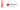

---
<p align="center">


</p>

theFrame is an animation tool.

---

# Dependencies
- Qt 5
  - Qt Core
  - Qt GUI
  - Qt Widgets
  - Qt Concurrent
  - Qt Network
  - Qt SVG
- [the-libs](https://github.com/vicr123/the-libs)
- FFmpeg (see below for more information)

## Build
Run the following commands in your terminal. 
```
mkdir build
qmake ../theDesk.pro
make
```

## Install
On Linux, run the following command in your terminal (with superuser permissions)
```
make install
```

# FFmpeg
For Windows and macOS builds, a copy of FFmpeg can be obtained using theFrame when you render.

On Linux, theFrame will use the system's FFmpeg installation.

---

> © Victor Tran, 2020. This project is licensed under the GNU General Public License, version 3, or at your option, any later version.
> 
> Check the [LICENSE](LICENSE) file for more information.